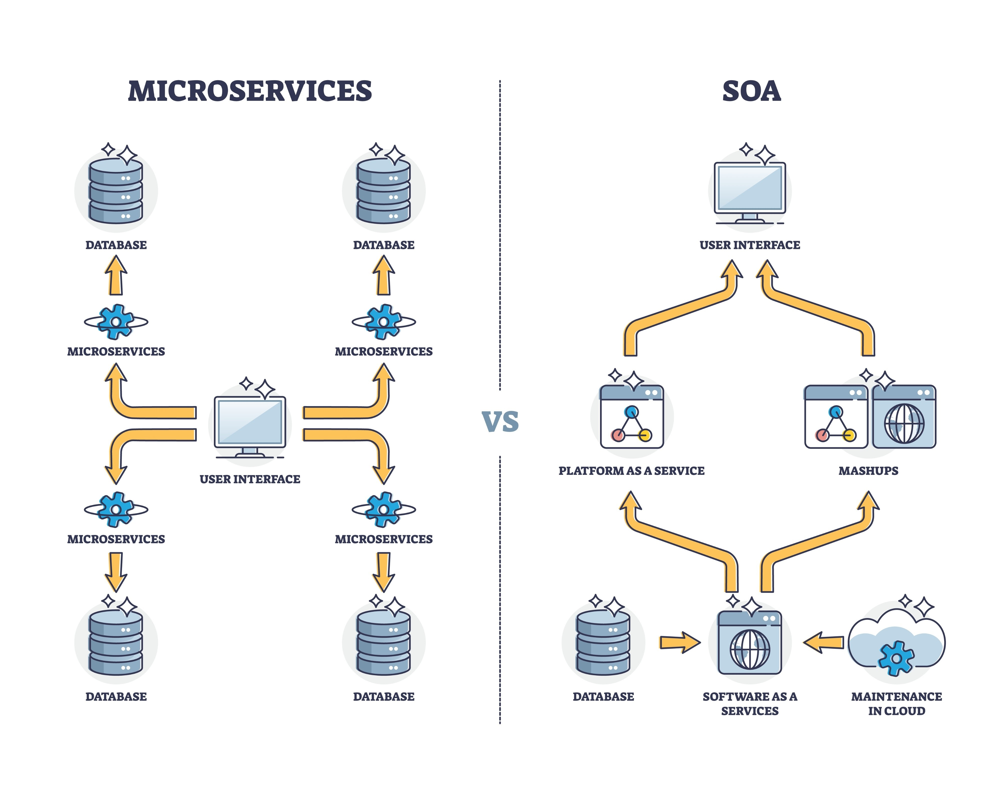

# Lesson 39: "Setting up Remote MySQL (Aiven or Neon)"

**Remote MySQL** မၢႆထိုင် Database ဢၼ်ပၼ်ႇယူႇၼိူဝ် Server ၶွင်ပိူၼ်ႈ (မိူၼ်ၼင်ႇ Google Cloud ဢမ်ႇၼၼ် AWS) ဢၼ်ႁဝ်းၵွင်ႉၸူးလႆႈၵူႈတီႈလူၺ်ႈ Internet ၶႃႈ။

### 1. ၵွပ်ႈသင်ႁဝ်းၸင်ႇလိူၵ်ႈ Aiven ဢမ်ႇၼၼ် Neon?
* **Free Tier:** မီးတွၼ်ႈတႃႇၸႂ်ႉလႆႈလၢႆလၢႆ Project လူၺ်ႈဢမ်ႇလူဝ်ႇသႂ်ႇ Credit Card။
* **Managed Service:** ၶဝ်ၸတ်းၵၢၼ်လွင်ႈ Backup လႄႈ Security ပၼ်ႁဝ်းႁင်းၵူၺ်း။
* **Global Access:** ႁဝ်းၵွင်ႉၸူးလႆႈတင်းၼႂ်း IntelliJ လႄႈ ၼႂ်း Docker Container ၶႃႈ။





---

### 2. ၸၼ်ႉၵၢၼ်သၢင်ႈ Database (Aiven Example)
1.  **Sign Up:** ၵႂႃႇတီႈ [aiven.io](https://aiven.io/) သေ Register လူၺ်ႈ Google Account။
2.  **Create Service:** လိူၵ်ႈ **MySQL** => လိူၵ်ႈ Plan **Free** => လိူၵ်ႈ Cloud Provider (မိူၼ်ၼင်ႇ Google Cloud)။
3.  **Get Credentials:** မိူဝ်ႈ Service တႄႇလႅၼ်ႈ (Running) ယဝ်ႉ ႁဝ်းတေလႆႈ:
    * **Host:** `mysql-xxx.aivencloud.com`
    * **Port:** `2xxxx`
    * **User:** `avnadmin`
    * **Password:** `xxxxxxxx`


---

### 3. ၵၢၼ်ၵွင်ႉ IntelliJ ၸူး Remote DB (တေၸႂ်ႉလႆးၼႂ်း Ultimate ၵူၺ်း)
ဢွၼ်တၢင်းတေဢဝ်ၵႂႃႇၸႂ်ႉၼႂ်း App, ႁဝ်းလူဝ်ႇၸမ်းတူၺ်းဝႃႈ ၶွမ်ႇႁဝ်းၵွင်ႉလႆႈႁႃႉ:
1.  ပိုတ်ႇ **Database** tab ၼႂ်း IntelliJ (ၽၢႆႇၶႂႃ)။
2.  ၼဵၵ်ႉ **+** => **Data Source** => **MySQL**။
3.  သႂ်ႇ Host, Port, User, Password ဢၼ်လႆႈမႃးတီႈ Aiven။
4.  ၼဵၵ်ႉ **Test Connection**။ သင်မၢၼ်ႇမႅၼ်ႈ မၼ်းတေၼႄပၼ် သီၶဵဝ်ၶႃႈ။

---

### 4. မႄး Config ၼႂ်း Spring Boot
ႁႂ်ႈၸဝ်ႈၶူးၵႂႃႇမႄးၼႂ်း **`application-prod.properties`** (ဢမ်ႇၼၼ် application.properties) ၶႃႈ:

```properties
# ၸႂ်ႉ URL ဢၼ်လႆႈမႃးတီႈ Cloud
spring.datasource.url=jdbc:mysql://mysql-xxx.aivencloud.com:2xxxx/defaultdb?ssl-mode=REQUIRED
spring.datasource.username=avnadmin
spring.datasource.password=your_cloud_password

# တွၼ်ႈတႃႇ Cloud, ႁဝ်းၵႆႉၸႂ်ႉ 'update' ဢမ်ႇၼၼ် 'none'
spring.jpa.hibernate.ddl-auto=update
```

---

### ၶေႃႈၵႂၢမ်း Technical ဢၼ်လူဝ်ႇမၢႆတွင်း

* **Managed Database:** Database ဢၼ်မီးၵူၼ်းၸတ်းၵၢၼ် Server ပၼ် (ႁဝ်းလူဝ်ႇၵူၺ်းတႅမ်ႈ SQL)။
* **Connection String:** လိၵ်ႈသူၼ် URL ဢၼ်ပႃး Host, Port လႄႈ DB Name ၸွမ်ၵၼ်။
* **SSL/TLS:** ၵၢၼ်ၵွင်ႉၸူး Database လူၺ်ႈမီးၵၢၼ် Encrypt ၶေႃႈမုၼ်း (လမ်ႇလွင်ႈၼႃႇတွၼ်ႈတႃႇ Cloud)။
* **Latency:** ၶၢဝ်းယၢမ်းဢၼ်သူင်ႇၶေႃႈမုၼ်းၵႂႃႇၸူး Cloud (မၼ်းတေၸႃႉလိူဝ် Localhost ဢိတ်းၼိုင်ႈ)။

---

**ၵၢၼ်ႁိူၼ်း (Homework):**
1. သင်ႁဝ်းၸႂ်ႉ **Remote MySQL** ယဝ်ႉၼၼ်ႉ... ႁဝ်းယင်းလူဝ်ႇပိုတ်ႇ **MySQL Workbench** ၼႂ်းၶွမ်ႇႁဝ်းယူႇႁႃႉ မိူဝ်ႈႁဝ်းပၼ်ႇ App?
2. ၵွပ်ႈသင်ႁဝ်းၸင်ႇထုၵ်ႇလီသႂ်ႇ **`ssl-mode=REQUIRED`** ၼႂ်း URL မိူဝ်ႈႁဝ်းၵွင်ႉၸူး Cloud Database?

**ၸဝ်ႈၶူးၶႃႈ!** မိူဝ်ႈလဵဝ် App **TaiGlish** ႁဝ်းမီး "မၢႆတွင်း" ၼိူဝ် Cloud ယဝ်ႉယဝ်ႉ။ Lesson 40 ႁဝ်းတေမႃးသွၼ်လၢႆးမႄး **Docker Compose** ႁႂ်ႈမၼ်းၵွင်ႉၸူး Remote DB ၼႆႉတႅၼ်းတၢင်ၵၢၼ်ၸႂ်ႉ DB ၼႂ်း Container ၶႃႈၼႃ!